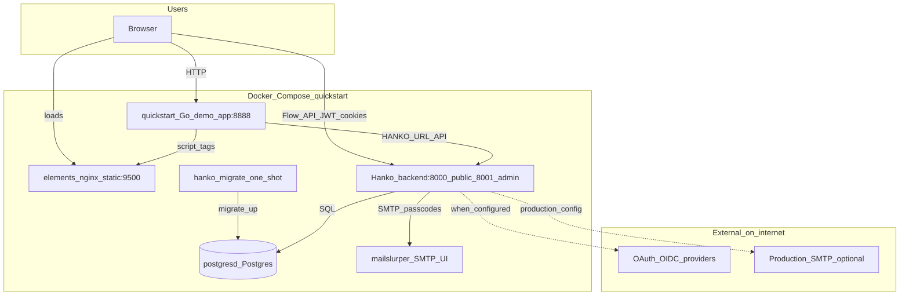
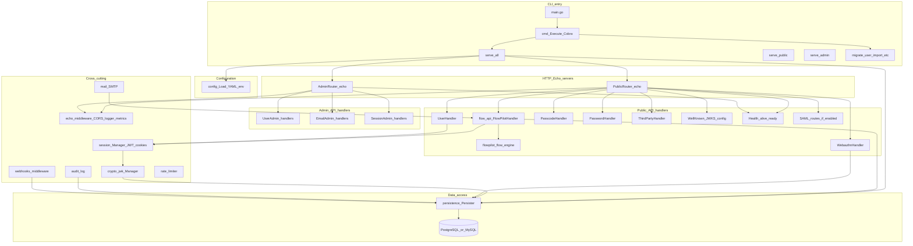
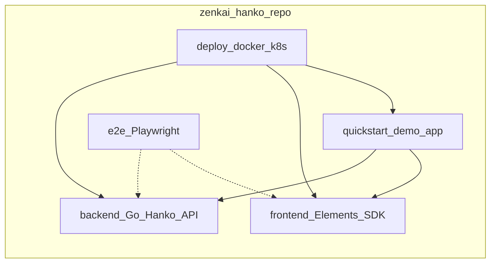

# Hanko (zenkai-hanko) architecture

This document describes **system** (deployment / runtime topology) and **software** (in-process structure of the Go backend) architecture for this repository. Diagrams use [Mermaid](https://mermaid.js.org/).

---

## System architecture

Typical **local full stack** matches [deploy/docker-compose/quickstart.yaml](../deploy/docker-compose/quickstart.yaml): Postgres, Hanko API (public + admin), static Elements bundle, demo Quickstart app, and an SMTP capture tool for passcodes.

**Notes**

- **Public API** (default `:8000`) serves registration/login/profile flows, WebAuthn, sessions, well-known JWKS, etc.
- **Admin API** (default `:8001`) serves operator endpoints; it should sit behind access control in production (see [backend/README.md](../backend/README.md)).
- **Quickstart** is a reference app; real integrations use your own frontend with [Hanko Elements](../frontend/elements) and/or the [Frontend SDK](../frontend/frontend-sdk).

---

## Software architecture (Hanko backend)

The backend is a **Go** service using **Cobra** for CLI commands, **Echo** for HTTP, and a **persistence** layer over **PostgreSQL or MySQL**. Two Echo instances are started when running `serve all` ([backend/cmd/serve/all.go](../backend/cmd/serve/all.go), [backend/server/server.go](../backend/server/server.go)).

**Notes**

- **Flow API** (`POST /registration`, `/login`, `/profile`, ...) is driven by **flowpilot** state machines and returns structured flow states for clients ([backend/handler/public_router.go](../backend/handler/public_router.go)).
- **Legacy-style REST** routes (WebAuthn, emails, users, third-party OAuth callbacks, etc.) coexist on the public router as configured in YAML.
- **Webhooks** can fire on selected lifecycle events; signing uses the same JWK machinery as session tokens where applicable.

---

## Repository map (related components)

For HTTP details and integration guides, see the official **[docs.hanko.io](https://docs.hanko.io)** API reference (source: [teamhanko/docs](https://github.com/teamhanko/docs)).

